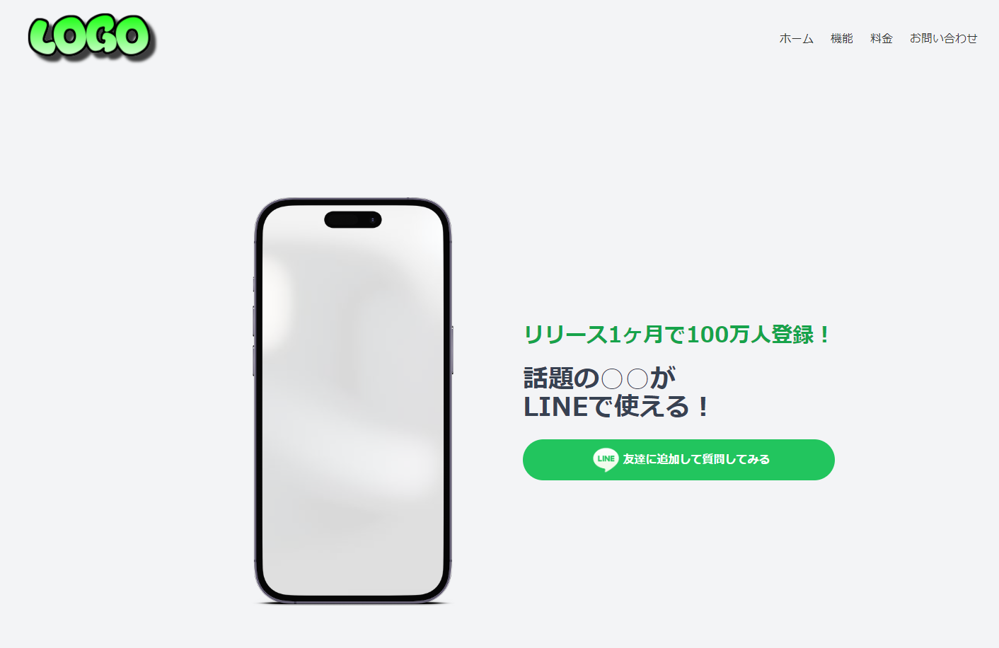

🌙 lambda-stripe-api
====


## 📗 プロジェクトの概要

Lambda(Node.js)でStripeのサブスクリプションを管理する為のサンプルです。
API経由でサブスクリプションの登録・解約・契約中かどうかの判別が出来ます。
SAM を利用して管理しているので、コマンドひとつでインフラを構築出来るようにしています。
また、Dockerを利用することでローカル環境でも実装・テストが出来るようにしています。

## 🌐 Demo



## 📦 ディレクトリ構造

```
.
├── README.md
├── backend (Lambdaのモジュール)
│   ├── dist
│   ├── jest.config.ts
│   ├── node_modules
│   ├── package-lock.json
│   ├── package.json
│   ├── src
│   ├── tests
│   └── tsconfig.json
├── frontend
│   ├── README.md
│   ├── node_modules
│   ├── package-lock.json
│   ├── package.json
│   ├── public
│   ├── src
│   └── tsconfig.json
├── layers (共通モジュール)
│   └── app-layer
├── samconfig.toml
├── task
│   ├── env.json
│   └── env.json.example
└── template.yaml
```

## 🔧 開発環境の構築

IAM ユーザーを用意する
```
ユーザ名：「lambda-user」
アクセス権限：
「AdministratorAccess」
```

SAM CLI をインストールする
```
$ pip install aws-sam-cli
```

AWSにアクセスする為の設定を作成する
```
$ aws configure --profile lambda-user 
AWS Access Key ID [None]: xxxxxxxxxx
AWS Secret Access Key [None]: xxxxxxxxxx
Default region name [None]: ap-northeast-1
Default output format [None]: json
```

## 💬 使い方

ローカルでAPIを起動する
```
# ESModuleでビルドできるようにする
$ npm install -g esbuild 
# SAMでアプリをビルドしてからAPIを起動する
$ sam build
$ sam local start-api --env-vars task/env.json --docker-network lambda-local

# 商品と含まれるプランの一覧を取得する
$ curl http://127.0.0.1:3000/product
$ curl "http://127.0.0.1:3000/product?productId=prod_xxxxx"

# 支払い処理（サブスクリプションを作成します）
$ curl -X POST -H "Content-Type: application/json" http://127.0.0.1:3000/payment -d '{ "paymentMethod": "pm_xxxxxx", "name": "test", email": "test@test.com", "planId": "price_xxxxx" }'
# キャンセル処理（サブスクリプションを解約します）
$ curl -X POST -H "Content-Type: application/json" http://127.0.0.1:3000/cancel -d '{ "email": "test@test.com", "planId": "price_xxxxx" }'
# アクティブチェック（サブスクリプションが有効かどうかを確認します）
$ curl -X POST -H "Content-Type: application/json" http://127.0.0.1:3000/active-check -d '{ "email": "test@test.com", "planId": "price_xxxxx" }'
```

本番環境（AWS） にデプロイする
```
# ビルドを実行する（.aws-samディレクトリに生成される）
$ sam build
# AWSに反映する
$ sam deploy --config-env stg

# AWSから、Lambda&APIGatewayを削除する
$ sam delete --stack-name lambda-stripe-api --profile lambda-user
```

## 🎨 参考

| プロジェクト| 概要|
| :---------------------------------------| :-------------------------------|
| [AWS SAM CLI 再入門 2021.08](https://qiita.com/hayao_k/items/7827c3778a23c514e196)| AWS SAM CLI 再入門 2021.08|
| [aws-sam-cliでLambda,DynamoDBのサーバーレスアプリケーション開発に入門してみる](https://qiita.com/umeneri/items/6fb3f7560f4a878f6dfd)| aws-sam-cliでLambda,DynamoDBのサーバーレスアプリケーション開発に入門してみる |
| [Lambda Layers をnode.js(SAM)で試してみる](https://qiita.com/monamu/items/96d63dd2151a8ab7e6cf)| Lambda Layers をnode.js(SAM)で試してみる |
| [serverless-expressでAPI GatewayからLambdaを実行する](https://zenn.dev/yuta_saito/articles/8b543a1957c375593ee5)| serverless-expressでAPI GatewayからLambdaを実行する |


## 🎫 Licence

[MIT](https://github.com/isystk/lambda-stripe-api/blob/master/LICENSE)

## 👀 Author

[isystk](https://github.com/isystk)
